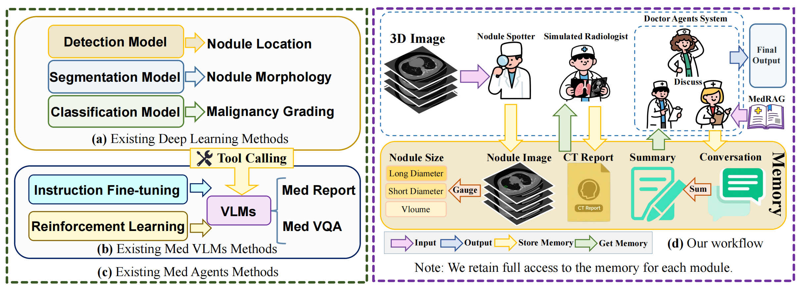
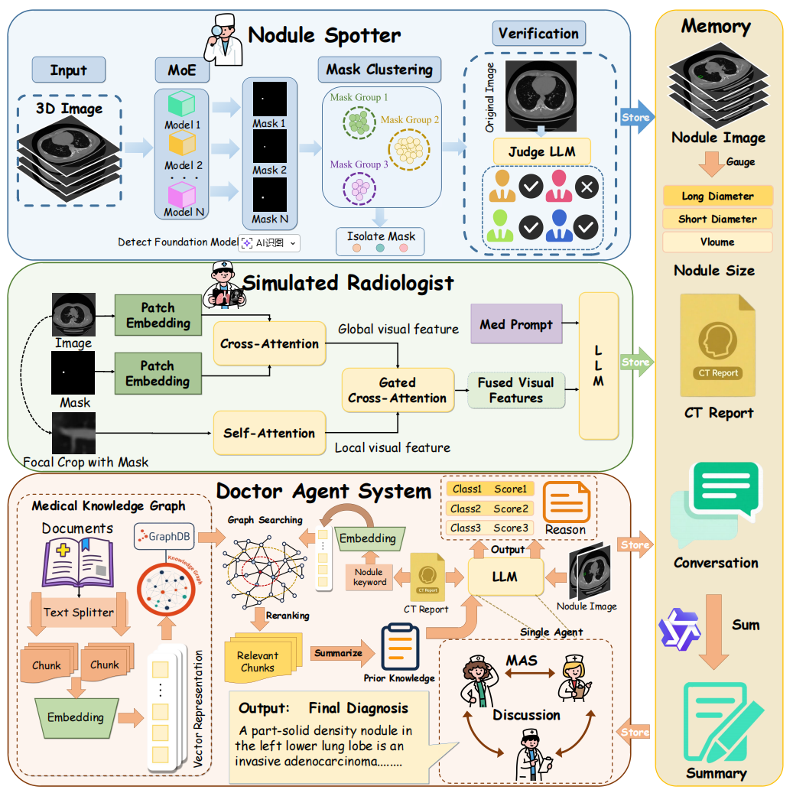
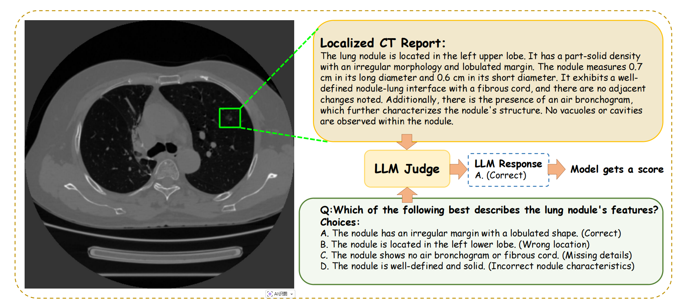
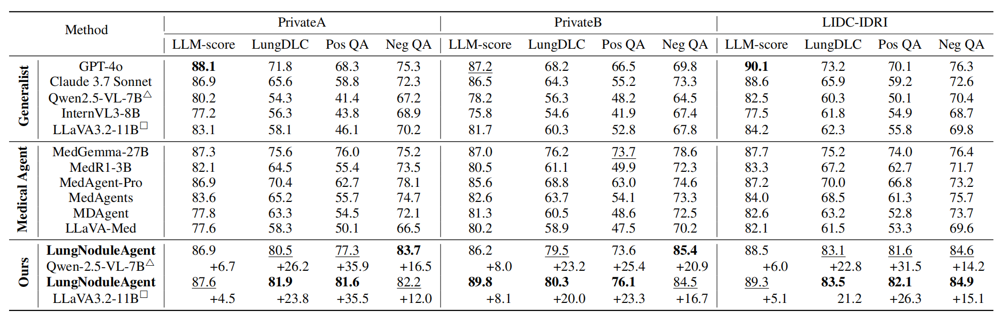
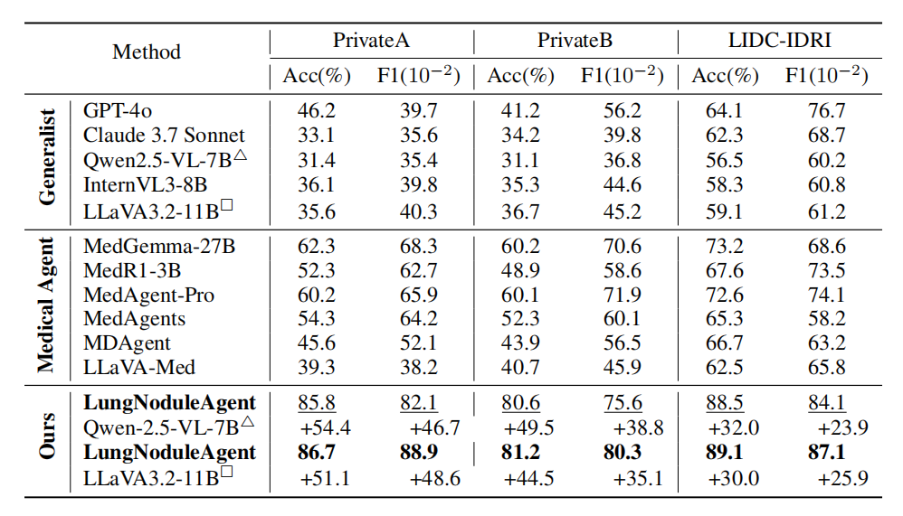

# LungNoduleAgent: Collaborative Multi-Agent Lung Nodule Diagnosis

> AAAI 2026 paper “LungNoduleAgent: A Collaborative Multi-Agent System for Precision Diagnosis of Lung Nodules”



## Repository Overview
- Clinical-style pipeline — “detection → report writing → malignancy grading” decomposed into collaborating agents to balance generality and precision.
- Core idea: region-level visual alignment + medical knowledge augmentation + multi-round consensus reasoning to improve fine-grained morphology descriptions and reliable malignancy assessment.
- Code reproduction and experiment scripts will be maintained here to support community research on public and private datasets.

## Highlights
- **Multi-agent collaboration**: Nodule Spotter (localization), Simulated Radiologist (localized report), Doctor Agent System (multi-doctor consensus) emulate real clinical roles.
- **Focal Prompting**: Fuse focal mask crops with global context to strengthen fine-grained perception and reduce hallucinated descriptions.
- **Medical knowledge graph + RAG**: DAS retrieves and summarizes authoritative knowledge for evidence-based reasoning instead of purely experiential answers.
- **Shared Memory**: Stores masks, cropped images, CT reports, and conversation summaries for cross-module reuse and multi-round reasoning.

## Workflow


1. **Nodule Spotter**: MoE detection + mask clustering + VLM judging panel filter to output high-confidence masks and local slices.
2. **Simulated Radiologist**: Focal Prompting + MedPrompt to generate localized CT reports; writes results to Memory.
3. **Doctor Agent System (DAS)**: Multiple medical agents with knowledge-graph retrieval discuss images and reports, converging to a graded malignancy decision with rationale.

## Key Components
- **MoE + clustering + judge panel**: Improve detection robustness and cut false positives.
- **Region-level descriptions**: Emphasize density, shape, margin, cavitation/vacuolation, and cross-slice dynamics.
- **Multi-round discussion**: Five agents (empirically best) balance diversity and consistency.
- **Graph-search RAG**: Build a medical knowledge graph from authoritative literature; answer via query-focused summarization plus image/report grounding.

## Data & Evaluation
- **Datasets**: Two private sets (1,616 / 386 axial 512×512 slices with masks, morphology attributes, and 3-way malignancy labels) and public LIDC-IDRI (1,018 cases with masks and 1–5 malignancy scores).
- **Metrics**:
  - CT reports: LLM-score (fluency/relevance/consistency/clinical rationality via GPT-4o) and LungDLC-score (attribute QA with positive/negative questions).
  - Malignancy grading: Acc / F1.
  - Detection: mAP / F1.



## Main Results



- Report generation: Highest LungDLC-score across three datasets (e.g., 83.5 on LIDC-IDRI), surpassing GPT-4o, Claude 3.7 Sonnet, Qwen2.5-VL, LLaVA, and medical VLMs.
- Malignancy grading: Acc/F1 notably ahead (e.g., 89.1 / 87.1 on LIDC-IDRI), showing the value of region alignment and multi-round discussion for clinical reasoning.

## Citation
If this work helps your research, please cite:

```
@article{yang2026lung,
  title   = {LungNoduleAgent: A Collaborative Multi-Agent System for Precision Diagnosis of Lung Nodules},
  author  = {Yang, Cheng and Jin, Hui and Yu, Xinlei and Wang, Zhipeng and Liu, Yaoqun and Fan, Fenglei and Lei, Dajiang and Jia, Gangyong and Wang, Changmiao and Ge, Ruiquan},
  journal = {Proceedings of the AAAI Conference on Artificial Intelligence},
  year    = {2026}
}
```